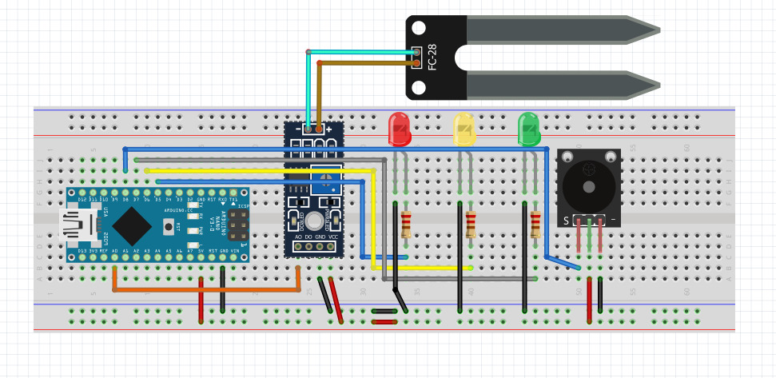

# Sistema_umidade_solo_evolucao1-
Evolução do sistema de umidade do solo, com módulo Buzzer acionado, conforme as aulas: 
Aula do desenvolvimento da interface física: https://youtu.be/n-mv8_Fkcog 
Aula do desenvolvimento do código fonte: https://www.youtube.com/watch?v=T4TARnxTDLQ&t=304s  

